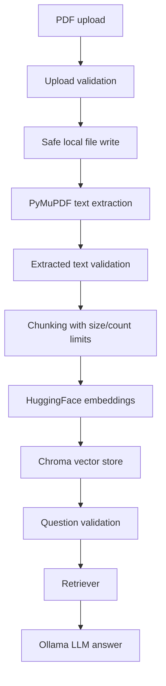

# Architecture

PDF QA LLM is a local-first retrieval-augmented generation app. It accepts a PDF, extracts text, chunks the content, persists embeddings in Chroma, and answers questions through an Ollama-hosted model.

## Flow

## Runtime Boundaries

- `app/main.py` exposes FastAPI routes and coordinates the request workflow.
- `app/config.py` centralizes runtime settings and environment parsing.
- `app/validation.py` owns upload, extracted-text, and question validation.
- `app/loaders.py` owns PDF text extraction.
- `app/vector.py` owns chunking, embedding creation, and vector persistence.
- `app/qa.py` owns vectorstore loading and LLM-backed question answering.

## Production Controls

- Uploads are capped by `MAX_UPLOAD_MB`.
- Filenames are normalized to the final path segment before writing.
- PDF content must have a `.pdf` name, expected content type, and `%PDF` signature.
- Extracted text must meet `MIN_EXTRACTED_CHARS`, which catches empty or scanned PDFs.
- Chunking has explicit `RAG_CHUNK_SIZE`, `RAG_CHUNK_OVERLAP`, and `RAG_MAX_CHUNKS` limits.
- Query requests return a clear `409` until a vector store exists.

## Local-First Tradeoff

The app intentionally depends on local Ollama and local Chroma persistence. That makes private document QA possible without sending documents to a hosted LLM, but it also means deployment needs explicit model/runtime setup.
